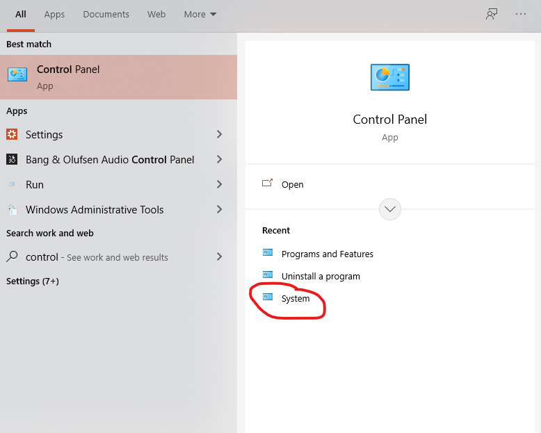

# Youtube Video Downloader

Download ANY YouTube video to your device to watch online with python!
What you need to install:
`python3 (version 3.5 or higher)` \
`pytube`\

Install python3:
https://python.org/downlaods \
Select the latest version of python and scroll down. You will see a list of files. If your computer is 32-bit, use the 32-bit installer. Likewise, if your PC is 64-bit use the 64-bit installer (that was only for windows, for mac just use the recommended one).\
\
To check if your computer is a 32-bit or 64-bit operater, click on the windows button and search "control panel" and select system at the bottom. It will say wheter it is 32-bit or 64-bit\
\
\
\
**MAKE SURE YOU CLICK ON THE "ADD PYTHON TO PATH" BUTTON WHEN INSTALL ON WINDOWS!**\

Install pytube and tkinter by going to your terminal (spotlight search for "terminal" on mac, press "windows+r" and then type `cmd` for windows) 

\
\

Then, type `pip3 install pytube`, and you are all set!\

\
